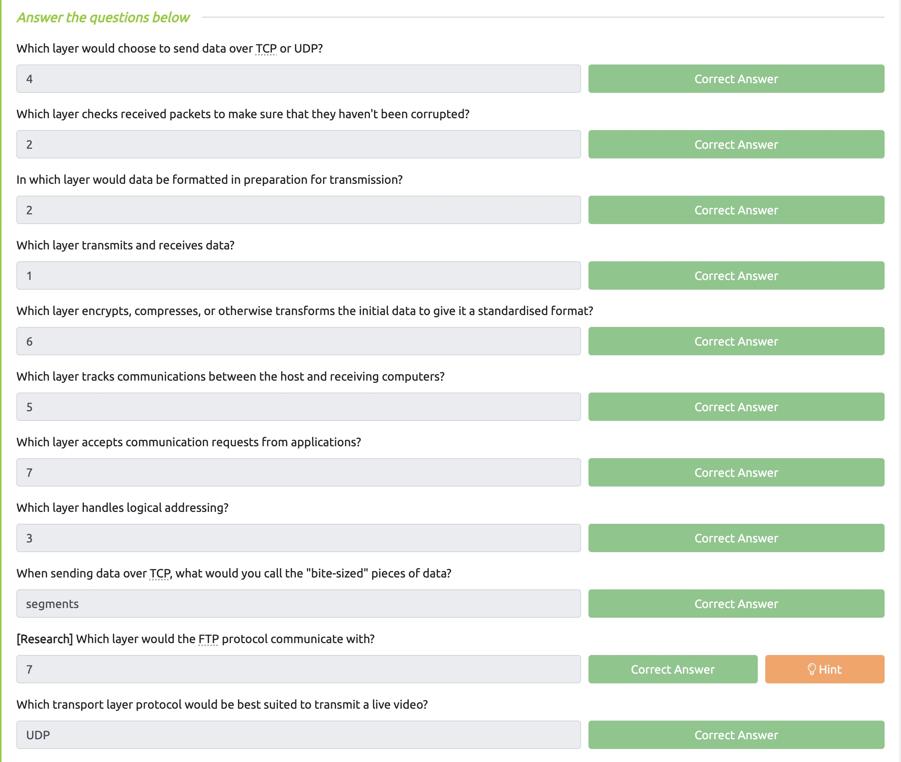
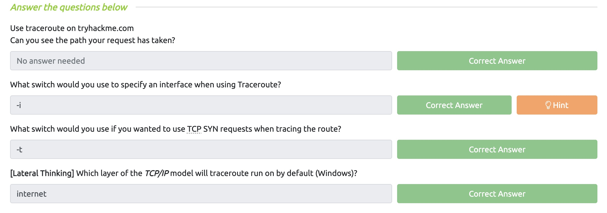
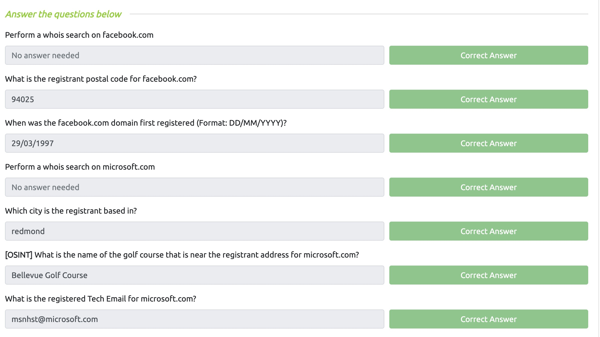
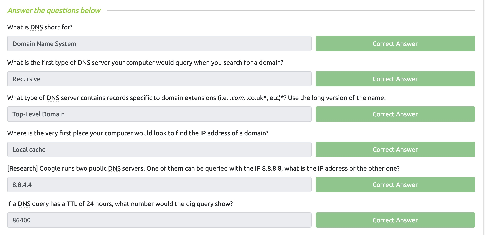

# Lab 1

### Juan Mercado
### February 4th, 2022

#### Overview

##### Task 1:

I read through the Task 1 Introduction for this weeks lab.

##### Task 2:

I read through Task 2 and it gave a detailed description of the OSI model. It stated that the OSI model consists of seven layers: Application, Presentation, Session, Transport, Network, Data Link, and the Pysical layers along with describing what each of the seven layers does. Once I finished reading about the different layers I answered the questions provided.

##### Task 3:

Task 3 described the encapsulation process between each of the layers of the OSI model and after the reading I completed the questions provided.

##### Task 4:

In this task I learned about the TCP/IP model and that it consists of four layers: Application, Transport, Internet and the Network interface along with giving a detailed description about how it works. Following the passage I finished the questions provided.

##### Task 5:

I read about a networking tool the **ping command** and learned that it is used when we want to test whether a connection to a remote source is possible. After looking at the examples provided I answered the questions.

##### Task 6:

I learned about another networking tool the **traceroute command** which is typically used after the **ping command**. This command is used to map the path your request takes as it goes towards the target machine. After referring to the examples in the reading I answered the questions provided.

##### Task 7:

I read about another networking tool called the **whois command** and it allows you to query who a domain name is registered to. Afterwards I completed the questions given regarding the reading.

##### Task 8:

I learned about another networking tool called the **dig command** which will manually query recursive DNS servers for information about a domain. Following the reading I finished the questions provided.

##### Task 9:

I read through the Task 9 Further Reading for this weeks lab.
