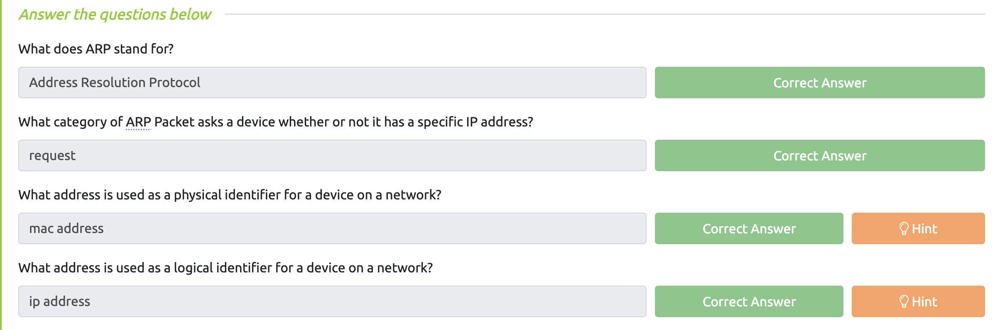

# Lab 2

### Juan Mercado
### February 11th, 2022

#### Overview

##### Task 1:

I read through Task 1 which gave a detailed description about LAN topologies, switches, and routers. After learning about what they are I was able to see how they work by doing the interactive lab attached to this task and completing the questions provided.

##### Task 2:

Subnetting is used to divide a network into pieces and having it consist of smaller networks within itself. After learning about how subnetting works and the different ways they use IP addresses I was able to answer the questions below the reading.

##### Task 3:

Address Resolution Protocol (ARP) is the technology that is responsible for allowing devices to identify themselves on a network. Mac Address is used as a physical identifies on the network while the IP address a logical identifier for a device on a network. After completing the reading I answered the questions.

##### Task 4:

Dynamic Hosts Configuration Protocol (DHCP) is used to assign an IP address. After learning about how the DHCP Protocol works I answered the quesitons provided.

##### Task 5:

I went to join the OSI Model room but it said it was for subscribers only.
