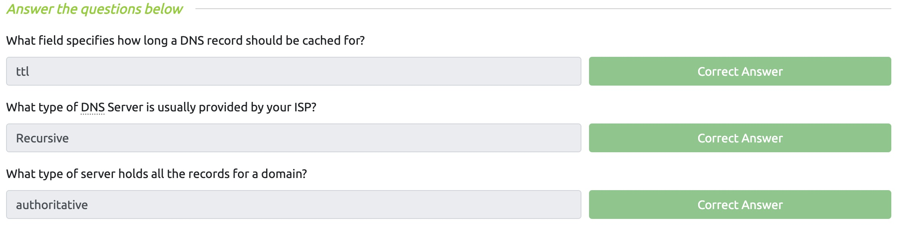

# Lab 3

### Juan Mercado
### February 20th, 2022

#### Overview

##### Task 1:

I read the paragraph that gave a description about what DNS (Domain Name System) is and how it works along with answering the questions. 

##### Task 2:

I learned about domain hierarchy and the three different types of domains: Root Domain, Top-Level Domain, and Second-Level Domain. After finishing the reading I answered the questions.

##### Task 3:

I read about the different types of DNS record types: A Record, AAAA Record, CNAME Record, MX Record, and TXT Record. After reading the paragraph I answered the questions.

##### Task 4:

I learned about what happens when you make a DNS request and answers the questions provided.

##### Task 5:

I ran the search for each question and answered them correctly.
