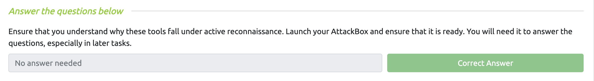
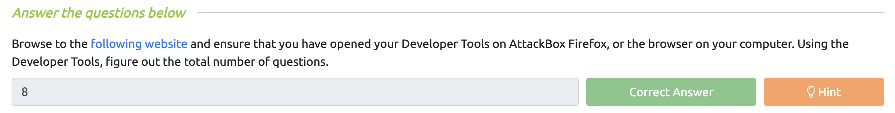
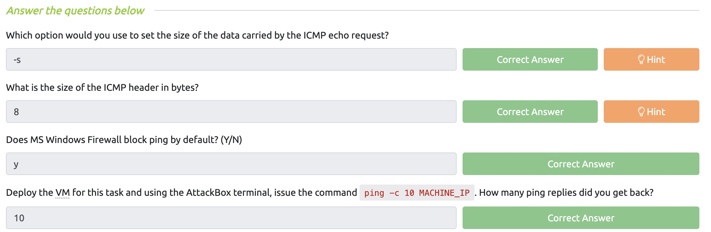
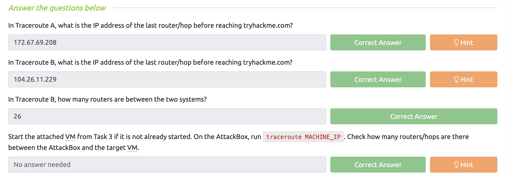
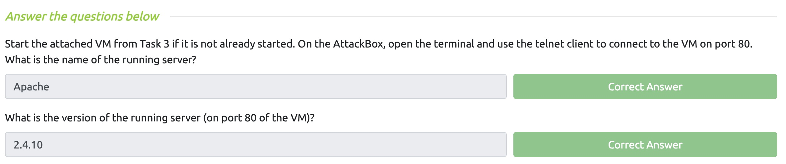
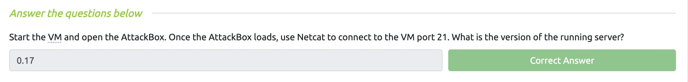
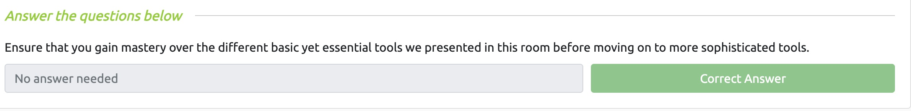

# Lab 4

### Juan Mercado
### March 9th, 2022

#### Overview

##### Task 1:

I read the introduction for this week's lab.

##### Task 2:

I conducted research and looked online to find the answers I needed to answer the questions.

##### Task 3:

I deployed the machine and used the MobSF application to analyze the file and find the information needed to answer the questions.

##### Task 4:

I used VirusTotal along with MobSF to help me answer the questions.

##### Task 5:

I used the MobSF software to help me analyze the file and answer the questions provided.

##### Task 6:

I used the MobSF software to analyze the file **sample2.apk** and used the information I found to answer the questions.

##### Task 7:

I read the conclusion to this week's lab and looked at the additional articles provided.
