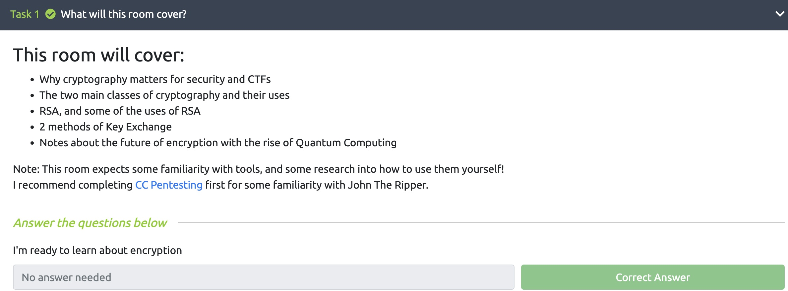
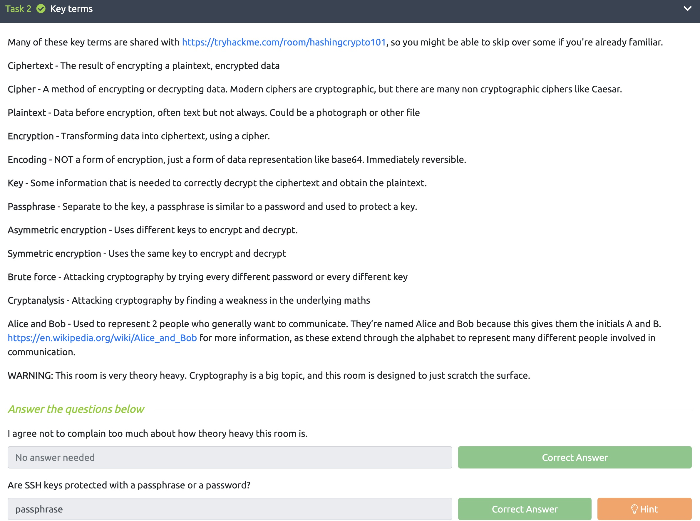
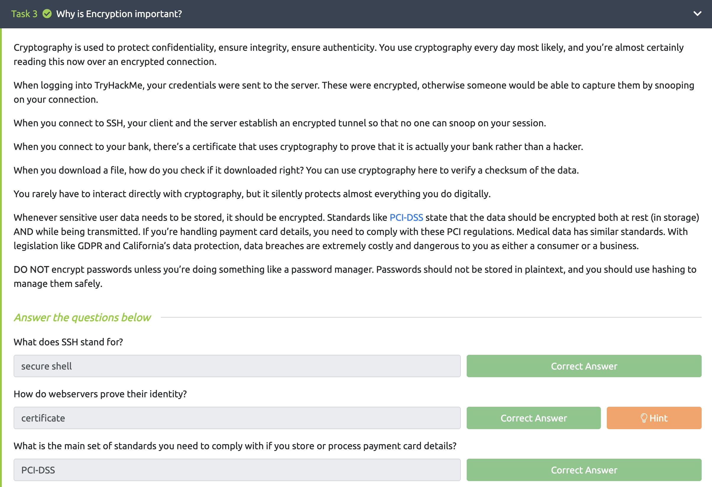
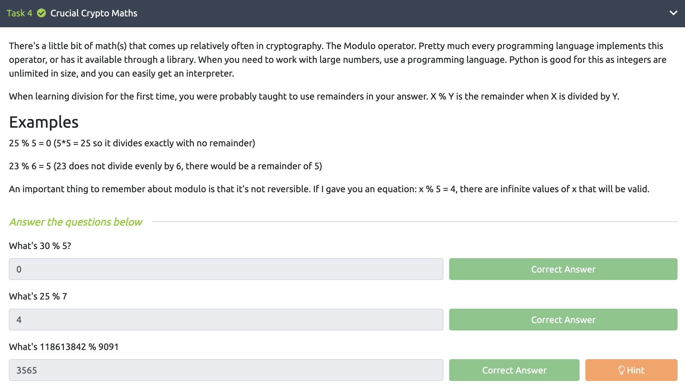
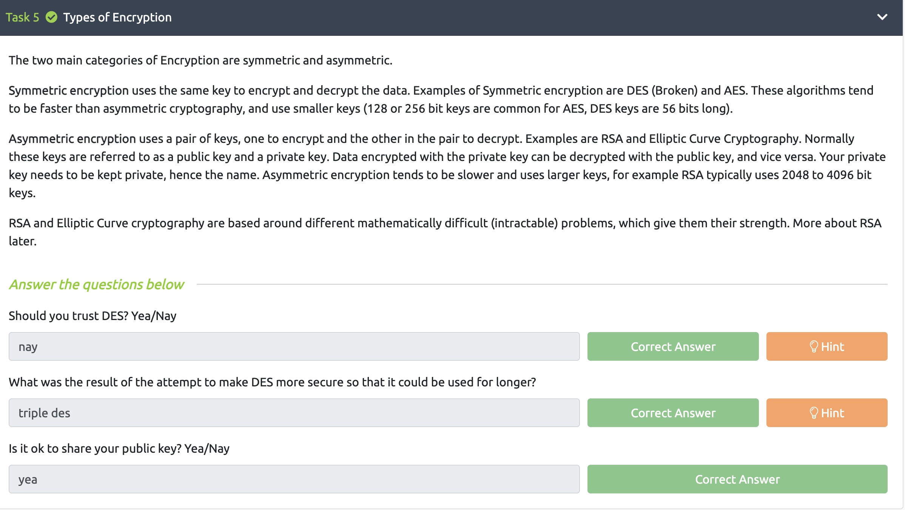
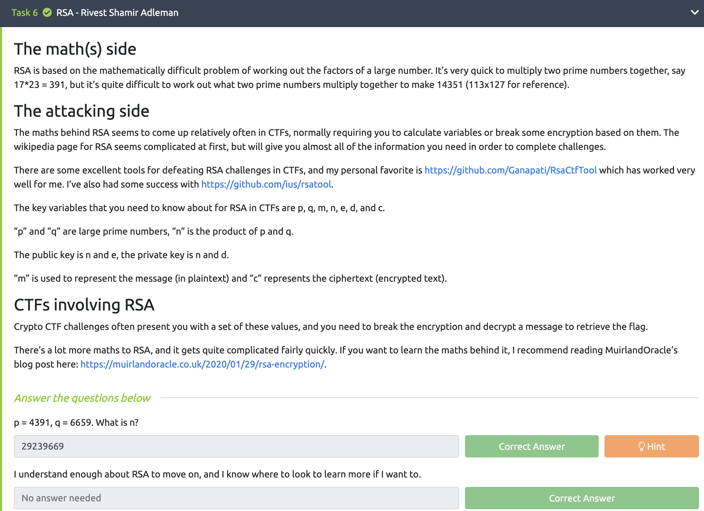
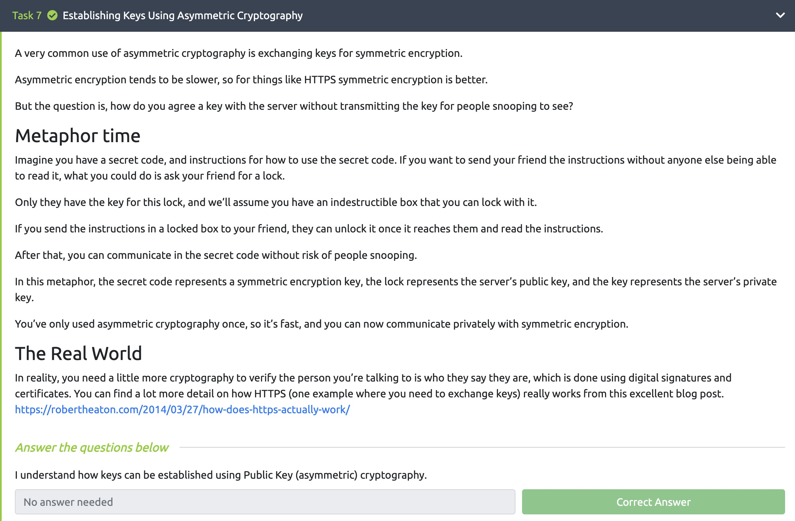
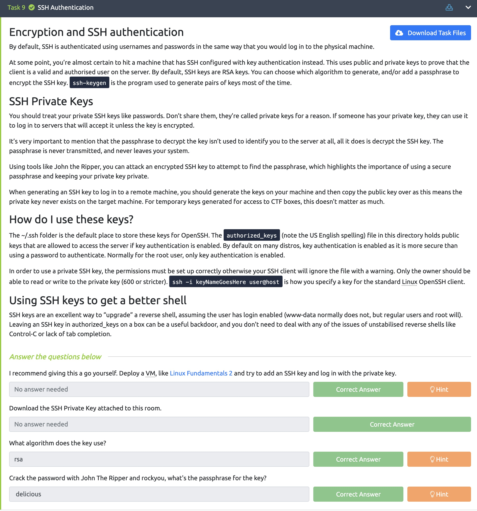
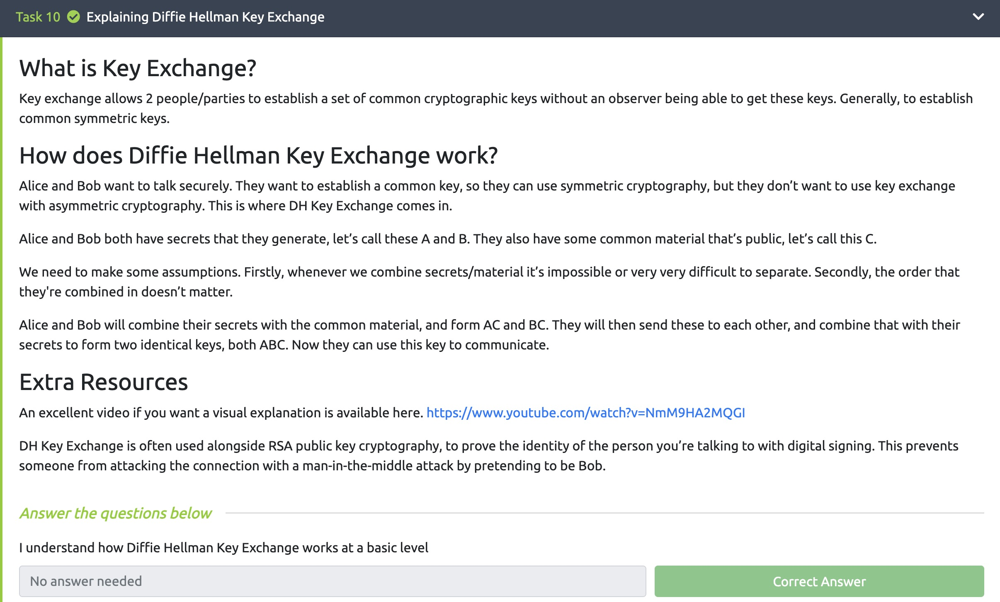
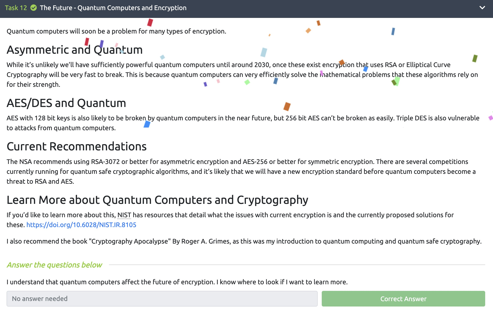

# Lab 5

### Juan Mercado
### March 18th, 2022

#### Overview

##### Task 1:

I read the introduction for this week's lab and it described to us what new information the room will cover.

##### Task 2:

In this task I learned about many key terms that are associated with cryptography and their definitions.

##### Task 3:

In this section I learned about why encryption is so important and why cryptography is so useful.

##### Task 4:

I learned about how the modulo operator works.

##### Task 5:

This task explains what the two main categories of encryption are: symmetric and asymmetric.

##### Task 6:

In this task I learned that RSA is based on mathematically difficult problems of working out factors of large numbers.

##### Task 7:

I read about how keys can be established using asymmetric cryptogtaphy.

##### Task 8:

I learned about digital signatures and certificates and why they are useful.

##### Task 9:

I learned about SSH authentication and using private keys.

##### Task 10:

I learned about how the Diffie Hellman Key Exchange works.

##### Task 11:

I read about different encryptions such as: PGP, GPG, and AES.

##### Task 12:

The conclusion explained what the future could look like with quantum computers posing a problem for many different types of encryption.
