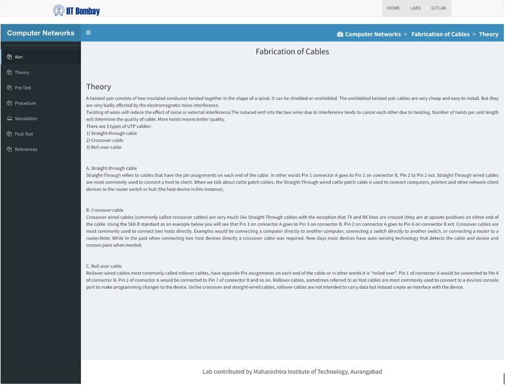
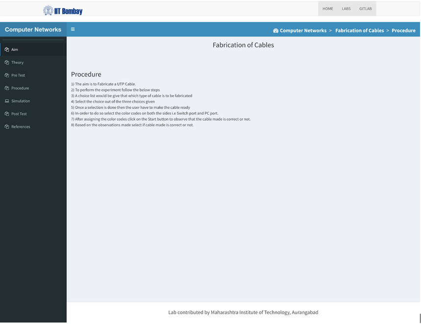
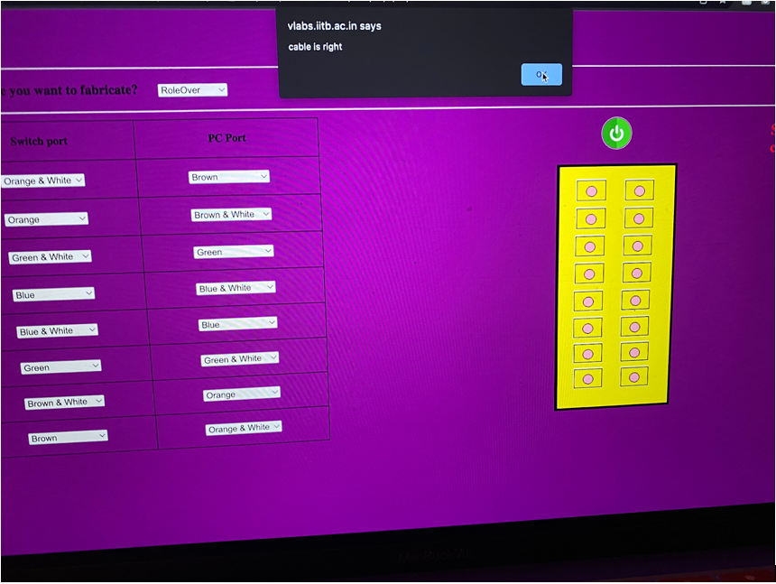
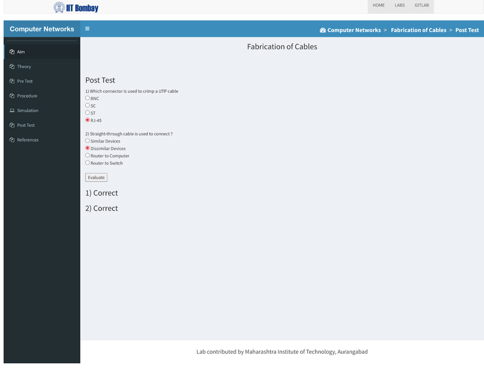

# Lab 5

### Juan Mercado
### March 18th, 2022

#### Overview

##### Task 1:

I read through the theory portion of this lab that gave a description about the fabrication of cables such as: Straight-through cable, Crossover cable, and Roll-over cable.

##### Task 2:

I completed the Pre Test and answered the questions correctly regarding the reading.

##### Task 3:

I read through a numbered list of the procedures to follow when determining which cable to fabricate.

##### Task 4:

I oriented the colors to the cross pattern.

##### Task 5:

I oriented the colors to the straight pattern.

##### Task 6:

I oriented the colors to the roll-over pattern.

##### Task 7:

I completed the Post Test and answered the questions correctly.
