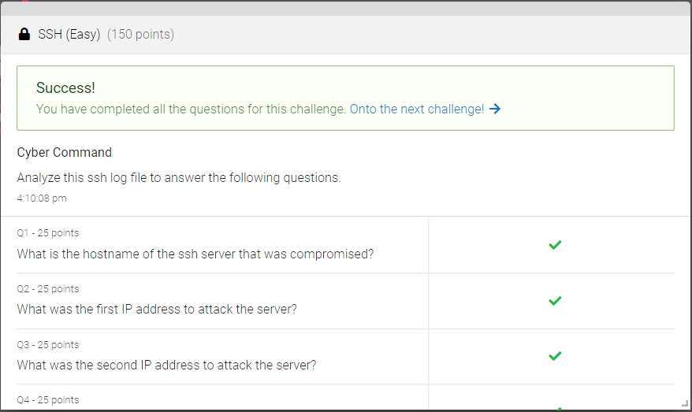

# NCL Gym

### Juan Mercado
### April 6th, 2022

#### Overview

##### Open Source Intelligence

Meta

I used the Jeffrey's Image Metadata Viewer to examine the image of the lamb to extract the metadata.

##### Cryptography

Crypto 2

I was able to determine that the ecryption was made using a Ceasar Cipher and decoded it using online tools.

##### Password Cracking

Cracking 1

Using the rock you word list I ran the command hashcat and was able to decrypt the encrypted passwords.

##### Log Analysis

SSH

I analyzed the log file and was able to detmine the answers to all the questions to the questions by skimming the log file for the information.

##### Network Traffic Analysis

DNS

I analyzed the file and examined the contents of the different packets, I used different filters so I could narrow down my search to find the data needed to answer the questions.

##### Wireless Access Exploitation

PCAP

I used wireshark and used the aircrack tool to help me examine the contents of the .pcap file and find the answers needed.

##### Forensics

Version Control

Using git commands I was able to find the data I was looking for.

##### Scanning

NMAP

Using the nmap command I was able to analyze all of the open ports.

##### Web Application Exploitation

egov

I used the developer tools in my browser to find the answers to the questions.

##### Enumeration & Exploitation

Python 1

After analyzing the vulnerabilties in the code I was able to determine what ket would pass validation.
